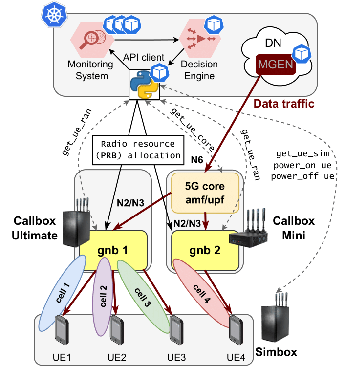

# Amarisoft-TANGO
The Amarisoft 5G SA testbed leverages Callbox Ultimate, Callbox Mini, and Simbox to establish RAN, core, and UE emulation, covering varied network scenarios. Config files detail setup for network functions, gNBs, core elements, and UE conditions, enabling reproducible 5G testing in diverse environments. please cite:

1) F. Rezazadeh, S. Barrachina-Muñoz, H. Chergui, J. Mangues, M. Bennis, D. Niyato, H. Song, and L. Liu, “Toward Explainable Reasoning in 6G: A Proof of Concept Study on Radio Resource Allocation”, IEEE Open Journal of the Communications Society, 2024. [[IEEE Xplore]](https://ieeexplore.ieee.org/document/10689363) [[arxiv]](https://arxiv.org/abs/2407.10186)
   

    

